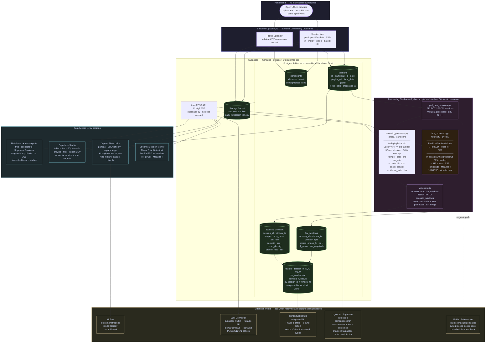
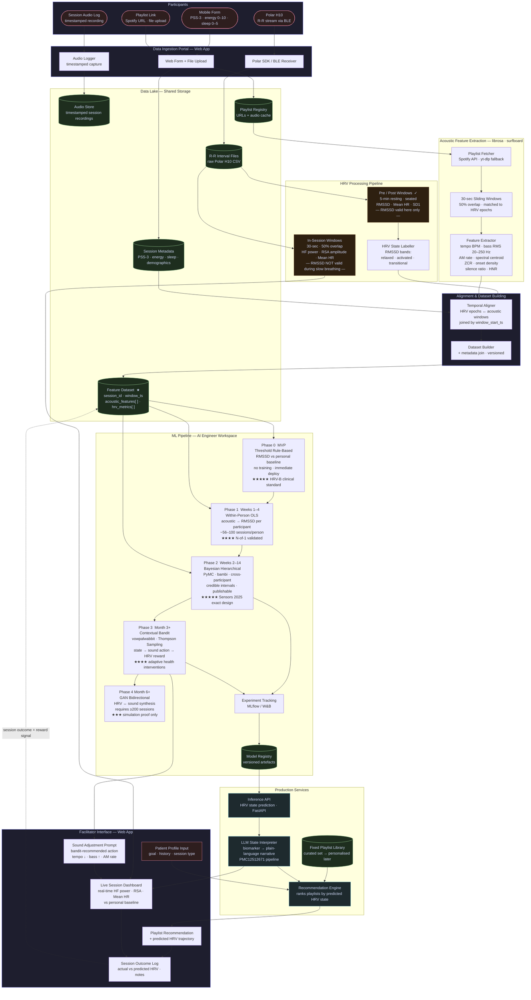

# Innerdance AI — Architecture

---

## V1 Implementation Architecture



---

## Platform Decision: Supabase + Streamlit + Metabase

| Layer | Tool | Cost | Maintained by |
|---|---|---|---|
| Database + Storage + API | Supabase (managed Postgres) | Free tier covers POC | Supabase cloud — zero ops |
| Upload form | Streamlit Community Cloud | Free | Push to GitHub → auto-deploy |
| Non-expert dashboards | Metabase (self-hosted or cloud) | Free OSS / $500/yr cloud | Connect once to Supabase Postgres |
| AI engineer workspace | Jupyter + supabase-py | Free | Local or Google Colab |
| Experiment tracking | MLflow | Free | Run locally: `mlflow ui` |
| Processing scripts | Python (neurokit2 + librosa) | Free | Run manually or GitHub Actions |

**Why not alternatives:**
- *Airtable* — too limited for timeseries data and ML queries
- *Firebase* — NoSQL makes analytical joins painful
- *AWS/GCP* — overkill ops burden for a 4-person POC
- *Neon/PlanetScale* — no built-in file storage or Studio UI; harder for non-experts

---

## Database Schema

```sql
-- one row per study participant
CREATE TABLE participants (
    id          uuid PRIMARY KEY DEFAULT gen_random_uuid(),
    name        text,
    email       text UNIQUE,
    demographics jsonb,           -- age, occupation, stress_context etc.
    created_at  timestamptz DEFAULT now()
);

-- one row per innerdance session
CREATE TABLE sessions (
    id              uuid PRIMARY KEY DEFAULT gen_random_uuid(),
    participant_id  uuid REFERENCES participants(id),
    session_date    date,
    playlist_url    text,
    form_data       jsonb,        -- PSS-3, energy 0-10, sleep 0-5, notes
    rr_file_path    text,         -- path in Supabase Storage bucket
    processed_at    timestamptz,  -- NULL = pending processing
    created_at      timestamptz DEFAULT now()
);

-- one row per 5-min pre/post window OR 30-sec in-session window
CREATE TABLE hrv_windows (
    id              uuid PRIMARY KEY DEFAULT gen_random_uuid(),
    session_id      uuid REFERENCES sessions(id),
    window_ts       timestamptz,  -- start of window
    window_type     text,         -- 'pre' | 'post' | 'in_session'
    rmssd           float,        -- ms  — valid only for pre/post windows
    mean_hr         float,        -- bpm
    sd1             float,        -- ms  Poincaré short-term
    hf_power        float,        -- ms² — in_session primary signal
    rsa_amplitude   float         -- ms  — in_session vagal index
);

-- one row per 30-sec acoustic window
CREATE TABLE acoustic_windows (
    id              uuid PRIMARY KEY DEFAULT gen_random_uuid(),
    session_id      uuid REFERENCES sessions(id),
    window_ts       timestamptz,  -- start of window — joins to hrv_windows
    tempo           float,        -- BPM
    bass_rms        float,        -- RMS energy 20-250 Hz
    am_rate         float,        -- amplitude modulation rate Hz
    spectral_centroid float,      -- Hz  brightness proxy
    zcr             float,        -- zero-crossing rate
    onset_density   float,        -- onsets/sec
    silence_ratio   float,        -- fraction of window below RMS threshold
    hnr             float         -- harmonic-to-noise ratio dB
);

-- AI engineers query this — no joins needed
CREATE VIEW feature_dataset AS
SELECT
    s.participant_id,
    h.session_id,
    h.window_ts,
    h.window_type,
    h.rmssd, h.mean_hr, h.sd1, h.hf_power, h.rsa_amplitude,
    a.tempo, a.bass_rms, a.am_rate, a.spectral_centroid,
    a.zcr, a.onset_density, a.silence_ratio, a.hnr,
    s.form_data->>'pss3_score'       AS pss3,
    s.form_data->>'energy_score'     AS energy,
    s.form_data->>'sleep_score'      AS sleep
FROM hrv_windows h
JOIN acoustic_windows a  USING (session_id, window_ts)
JOIN sessions s          ON s.id = h.session_id;
```

---

## AI Engineer Extension Path

How an AI engineer picks up from V1 without any architecture change:

```
1. EXPLORE          read feature_dataset via supabase-py or SQLAlchemy
                    pd.read_sql("SELECT * FROM feature_dataset", conn)

2. PHASE 0 (now)    threshold rule — compare RMSSD pre vs post per participant
                    ~2 hours to implement in a notebook

3. PHASE 1 (wk 1-4) within-person OLS per participant
                    statsmodels.formula.api.ols("rmssd ~ tempo + bass_rms + ...", data)

4. PHASE 2 (wk 2-14) Bayesian hierarchical model
                    import bambi as bmb
                    model = bmb.Model("rmssd ~ tempo + (1|participant_id)", data)

5. PHASE 3 (mo 3+)  contextual bandit — plug into existing feature_dataset
                    import vowpalwabbit as vw

6. REGISTER MODEL   mlflow.sklearn.log_model(model, "hrv_state_predictor")

7. SERVE            FastAPI endpoint reads model from MLflow registry
                    POST /predict  { acoustic_features } → { hrv_state, confidence }

8. CONNECT FACILITATOR UI  Streamlit reads from /predict + feature_dataset
```

---

## Conceptual Architecture (research reference)



### Critical Design Constraints (from literature)

**RMSSD validity boundary** — RMSSD is only valid during the standardised 5-min pre/post resting windows (controlled breathing). Do NOT use RMSSD as the real-time in-session signal. Use HF power or RSA amplitude during sessions (AJP-Regu 2022).

**Acoustic feature logging is the bottleneck** — Without timestamped audio logs aligned to R-R data, Hypothesis 3 (acoustic → HRV coupling) cannot be tested. This infrastructure must be in place before sessions begin.

### Top Acoustic Features (empirically linked to HRV/ANS)

| Feature | Tool | Literature grounding |
|---|---|---|
| Tempo (BPM) | `librosa.beat.tempo` | ≤60 BPM → parasympathetic ↑ (PMC5339732, PMC4540583) |
| Bass energy RMS 20–250 Hz | `librosa.feature.rms` (filtered) | Ventral vagal postulated; innerdance low-freq signature |
| Amplitude modulation rate | Hilbert envelope | Brain.fm neural phase-locking (Woods et al. 2024, Nature portfolio) |
| Spectral centroid | `librosa.feature.spectral_centroid` | Brightness proxy; high = alerting, low = calming |
| Zero-crossing rate | `librosa.feature.zero_crossing_rate` | Roughness / harmonic complexity |
| Onset density | `librosa.onset.onset_detect` | Event rate; higher = more activating |
| Silence ratio | RMS threshold | Active regulatory tool in innerdance (documented in source) |
| Harmonic-to-noise ratio | `librosa.effects.harmonic` | Consonance; linked to social engagement system (SSP analogy) |
